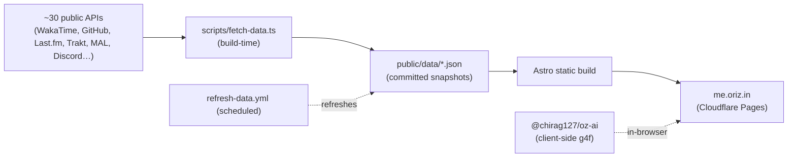

# oriz-me — an engineer's instrument bench

> A public, static dashboard for [me.oriz.in](https://me.oriz.in) that aggregates Chirag Singhal's work, open source, media library, live coding activity, and life stats from ~30 public APIs at build time.

- **Live app:** https://me.oriz.in
- **About / info page:** https://chirag127.github.io/oriz-me/ (published from `gh-info/` via `.github/workflows/gh-pages-info.yml`)
- **For LLMs:** [llms.txt](https://me.oriz.in/llms.txt) · [llms-full.txt](https://me.oriz.in/llms-full.txt)
- **Repo:** https://github.com/chirag127/oriz-me

[](https://github.com/chirag127/oriz-me/actions/workflows/deploy.yml)
[](https://github.com/chirag127/oriz-me/stargazers)
[](https://github.com/chirag127/oriz-me/commits/main)
[](./LICENSE)
[](https://astro.build)

## What it is / why it exists

A personal OS — an engineer's instrument bench. Rather than a static résumé page, `me.oriz.in` is a live public dashboard that pulls Chirag's career, open source, media, and lifestream from ~30 public APIs at build time and bakes them into static JSON, so there is no runtime backend to run or pay for. It is 100% client-side: no upload, no signup, no ads, no tracking wall. An optional oriz SSO exists but gates nothing public.

⭐ If this is useful, please **star the repo** — it helps others find it.

## How it works



## What it does

- **Work** — career, projects, skills, education, certifications, open source, writing.
- **Library** — music, movies, TV, anime, manga, books, gaming, podcasts + a live activity feed.
- **Me** — now, story, timeline, values, goals, gear, philosophy, coding activity, journal, health, AI digital twin, FAQ.
- **Live readouts** — WakaTime coding time, GitHub repos, Last.fm scrobbles, Trakt films, Discord presence.
- Data from ~30 APIs pulled at build time into static JSON — no runtime backend.

## Tech stack

- **Astro** (`output: static`) + **React 19** islands + **Tailwind v4**.
- **@vite-pwa/astro** — installable PWA; static shell offline, live data network-only.
- **@chirag127/oz-ai** — g4f client-side AI (digital twin + Ask), runs in-browser, no server key.
- **@clerk/clerk-react** + **Firebase** — optional oriz SSO (gates nothing public).
- Hosted on **Cloudflare Pages**; a scheduled workflow refreshes data snapshots.

## Repo structure

```
src/
  components/          # dashboard surfaces (React islands + Astro)
  data/                # static content + typed data
  layouts/ · lib/ · pages/ · styles/
scripts/
  fetch-data.ts        # build-time fetch of ~30 APIs → public/data/*.json
  prepare-networth.mjs
public/data/*.json     # committed snapshots — source of truth
gh-info/index.html     # GitHub Pages info page
.github/workflows/
  deploy.yml           # astro build + wrangler pages deploy (oriz-me)
  refresh-data.yml     # scheduled data refresh (secrets present)
  gh-pages-info.yml    # publishes gh-info/ to GitHub Pages
astro.config.mjs       # site: https://me.oriz.in
```

## Develop

Windows: use **npm**, not pnpm (pnpm skips `@esbuild/win32-x64`).

```bash
npm install --legacy-peer-deps
npm run dev              # astro dev
npm exec astro build     # build WITHOUT refreshing data (safe)
npm run test:e2e         # playwright
```

> ⚠️ `npm run build` runs `scripts/fetch-data.ts` first — **without API keys it writes empty JSON** over `public/data/*`. CI and Cloudflare run `astro build` **only**; the committed snapshots are the source of truth. `refresh-data.yml` updates them on schedule with secrets present.

## Deploy

Push to `main` → `deploy.yml` runs `astro build` + `wrangler pages deploy dist --project-name=oriz-me` (needs `CLOUDFLARE_API_TOKEN` + `CLOUDFLARE_ACCOUNT_ID`). The info page at [chirag127.github.io/oriz-me](https://chirag127.github.io/oriz-me/) ships from `gh-info/` via `gh-pages-info.yml`.

## Configuration

Names + purpose only — never commit real values. `PUBLIC_*` keys ship to the browser by design; the lifestream feed keys are build-time only. See `.env.example`.

| Variable | Purpose |
| --- | --- |
| `CLOUDFLARE_API_TOKEN` | Deploy to Cloudflare Pages (CI secret). |
| `CLOUDFLARE_ACCOUNT_ID` | Cloudflare account for the Pages project. |
| `PUBLIC_CLERK_PUBLISHABLE_KEY` | Clerk publishable key; optional SSO, gates nothing public. |
| `PUBLIC_FIREBASE_*` | Firebase Web client config (API key, auth domain, project id, storage bucket, messaging sender id, app id). |
| `TRAKT_CLIENT_ID` / `TRAKT_USERNAME` | Trakt films/TV lifestream (build-time). |
| `MAL_CLIENT_ID` / `MAL_USERNAME` | MyAnimeList anime/manga (build-time). |
| `LASTFM_API_KEY` / `LASTFM_USERNAME` | Last.fm scrobbles (build-time). |
| `LISTENBRAINZ_USERNAME` | ListenBrainz listens (build-time). |
| `GOODREADS_USER_ID` | Goodreads books (build-time). |
| `DISCORD_USER_ID` | Discord presence (build-time). |

_Plus additional lifestream feed keys (WakaTime, GitHub, etc.) consumed by `scripts/fetch-data.ts` — names only, no values in the repo._

## Screenshots

_Placeholder — add a capture of the Work / Library / Me instrument bench._

## Part of the oriz family

One of ~80 sites in the **oriz** family. See how the fleet is built at [blog.oriz.in](https://blog.oriz.in).

- **Cost:** $0 on the Cloudflare free tier.

## Security

No secrets in the repo; the fleet uses a **sops + age** vault (`.env.enc`). Only `PUBLIC_*` client keys ship to the browser; deploy tokens and feed keys live in CI secrets, never in source. No private PII is embedded — this is a public, aggregate view of public work.

## Contributing

Issues and PRs welcome — keep them terse. Conventional commits, `main`-only. See [CONTRIBUTING.md](./CONTRIBUTING.md).

## Status / roadmap

Stable and live at me.oriz.in; data refreshed on schedule.

## Changelog

Conventional commits are the changelog.

## License

Code [MIT](./LICENSE). Prose CC-BY-4.0.

## Author

Chirag Singhal · chirag@oriz.in
